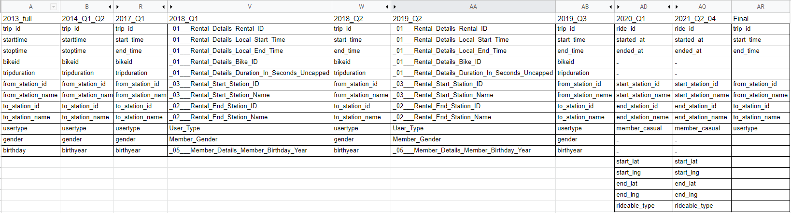
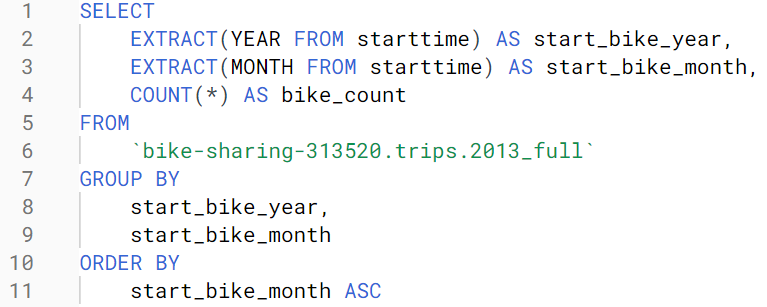

***
# Introduction
For this scenario, I will be helping a bike sharing company named "Cyclistic" to improve their profitability by converting casual bike riders to membership riders using digital media. The bikes are docked in various stations throughout the city and can be ridden to any other station for a fee. There are multiple pricing plans to service multiple consumer segments such as single-ride passes, full day passes, and annual memberships. Riders who purchase single-ride or full-day passes are referred to as casual riders, while customers who purchase annual memberships are Cyclistic members. The financial department of the company determined that annual members are more profitable that casual riders, and the key to future growth would be to maximize the number of annual memberships. The company tasked me to create a digital media plan to convert casual riders into members since casual riders are already aware of the Cyclistic program and have chosen Cyclistic for their transportation needs. 

***
# Approach 
We will be using the company's data set to create a solution to the problem. This data set contains trip level data that identifies whether a customer is a casual or annual members; dating back to 2013. By analyzing the data we can understand how casual riders differ from annual members. Once we establish why customers choose to buy casual passes rather than annual passes, we will then use that info to incentivize customers to choose the annual pass over the casual pass. Then finally we will implement the digital media strategy based on the information we gathered. 

***
# Analysis

## Initialize
```{r,warning=FALSE,message=FALSE}
#Installing required packages
library(tidyverse)  #helps wrangle data
library(lubridate)  #helps wrangle date attributes
library(ggplot2)  #helps visualize data

# Setting working directory - data and images are saved to this directory 
setwd("C:/Users/Kevin/Documents/Bike Sharing")

# Check working directory 
getwd()
```

## Data
This is data comes from Motivate International Inc. which operates the City of Chicago’s Divvy bicycle sharing service. For this case study we are pretending that this data is coming from the hypothetical company "Cyclistic Bikes".
The location of the data set originates from [here](https://divvy-tripdata.s3.amazonaws.com/index.html).
The data has been made available by Motivate International Inc. under this [license](https://www.divvybikes.com/data-license-agreement).

I prepare and process the data using Google's Big Query (SQL). I begin by downloading every file from April 2021 (the latest data as of analysis) to the year 2013. These files contained trip level data and other variables pertaining to the bike ride. There are slightly different naming conventions throughout different years as shown in this table below.
<br/>
<br/>
 
<br/>
<br/>
Beginning 2020 and on, there are a few variables that are dropped and added to the data sets. In order to make the data consistent I rename every variable to match one another, and also change the data type to match as well. I perform logical checks such as validating null values, duplicates and date checks to make sure the data is clean. I also changed the outputs of the member and casual riders to be consistent with each other. Previously the values were "member" and "casual", and other tables used "subscriber" and "customer". Trips with negative duratation are excluded. Below is one of the queries that I used to validate that the data contains the appropriate values.
<br/>
<br/>
{width=50%} 
<br/>
<br/>

I also combined data from 2020 to 2021 into one data set to be analyzed. The years 2013 to 2019 are also combined since they all contain the same variables, whilst 2020 to 2021 removes and adds different variables. We will be using 2020 to 2021 data in this analysis since they are the most recent and contain more than enough data to draw conclusions of out analysis (Over 4 million observations). 


```{r}
# Importing data set and assigning it to variable.
df_2020_2021 <- read.csv(file = "data/export_2020_2021")

# Check
head(df_2020_2021)
```

After importing the data from SQL Database, we should also check that the data is still clean and is usable. Looking at the summary table we can check that data types are correct, numerical ranges are reasonable, and all variables are included. 
```{r}
summary(df_2020_2021)
```

Next we can check the outputs of some variables to make sure they are what we expect to see. 
```{r}
# showing the different user types and the counts of each.
table(df_2020_2021$usertype)
# showing the ride-able types and the counts of each.
table(df_2020_2021$rideable_type)
```
As we can see the variables are the ones that we expected, since we cleaned the data to be consistent. 

While looking through the data I noticed that there are a few testing sites that we should exclude from our analysis. 
```{r}
# filtering trips that contain the "test" string in the from_station_name column. These trips should not be included since that are testing the bike or the station that the bike is at. Therefore not actual rides by customers. 
df_2020_2021 %>% filter(grepl('TEST|test', from_station_name))
```
Since we are removing data we will create another data frame. The number of rows that will be removed should be 91. 
```{r}
# creating a new data frame that excludes testing stations. 
df_2020_2021_v2 <- df_2020_2021[!(df_2020_2021$from_station_name == "HUBBARD ST BIKE CHECKING (LBS-WH-TEST)" | df_2020_2021$from_station_name == "hubbard_test_lws" | df_2020_2021$from_station_name == "WATSON TESTING - DIVVY"),]

# checking the number of entries removed. 
dim(df_2020_2021)-dim(df_2020_2021_v2)
```

We will also be aggregating the data into various time increments. This will help in our analysis since trip level data is too granular. 
```{r}
#creating date, month, day, year, and day of the week into main table.
df_2020_2021_v2$date <- as.Date(df_2020_2021_v2$start_time)
df_2020_2021_v2$month <- format(as.Date(df_2020_2021_v2$date), "%m")
df_2020_2021_v2$day <- format(as.Date(df_2020_2021_v2$date), "%d")
df_2020_2021_v2$year <- format(as.Date(df_2020_2021_v2$date), "%Y")
df_2020_2021_v2$day_of_week <- format(as.Date(df_2020_2021_v2$date), "%A")
#check
head(df_2020_2021_v2)
```

## Statistical Analysis

Now that we have a clean data set with useful information, we will start by analyzing the percentage of casual riders to members within our data set. This will be useful information to have when we are analyzing out numbers.
```{r}
# calculating the portion of each user type. 
# creating data frame with user counts. 
type_count <- as.data.frame(table(df_2020_2021_v2$usertype))

# creating count variables
cas_count <- type_count[1,2]
mem_count <- type_count[2,2]
tot_count <- cas_count + mem_count
# creating percentage of total counts
cas_per <- cas_count / tot_count
mem_per <- mem_count / tot_count
cas_per
mem_per
```
In this data set 38% are casual riders, while 62% are members. We will need to keep this in mind since it will potentially skew our analysis.

Next we will begin looking at the duration of the rides to see if there is any difference between the type rider types. 

```{r}
# calculating descriptive statistics for duration of entire data set.
tot_min_dur <- min(df_2020_2021_v2$duration)
tot_med_dur <- median(df_2020_2021_v2$duration)
tot_mea_dur <- mean(df_2020_2021_v2$duration)
tot_max_dur <- max(df_2020_2021_v2$duration)

# adding total name to vector
r_min <- c ('total', tot_min_dur)
r_med <- c ('total', tot_med_dur)
r_mea <- c ('total', tot_mea_dur)
r_max <- c ('total', tot_max_dur)

# calculating descriptive statistics for duration of each user type. 
us_min_df <- aggregate(df_2020_2021_v2$duration ~ df_2020_2021_v2$usertype, FUN = min)
us_med_df <- aggregate(df_2020_2021_v2$duration ~ df_2020_2021_v2$usertype, FUN = median)
us_mea_df <- aggregate(df_2020_2021_v2$duration ~ df_2020_2021_v2$usertype, FUN = mean)
us_max_df <- aggregate(df_2020_2021_v2$duration ~ df_2020_2021_v2$usertype, FUN = max)

# combining total descriptive statistics
us_min_df <- rbind(us_min_df, r_min)
us_med_df <- rbind(us_med_df, r_med)
us_mea_df <- rbind(us_mea_df, r_mea)
us_max_df <- rbind(us_max_df, r_max)

# output descriptive statistics for duration
#us_min_df
us_med_df
us_mea_df
#us_max_df
```
Looking at these median duration we can see that casual members (21) have a higher duration than members (11). If we look at the mean, casual riders (46.06) also have a much higher average compared to members (15.25). 

Next we will look at the data split by the days of the week, to see if we can discover any differences. 

```{r}
#reordering to days of the week.
df_2020_2021_v2$day_of_week <- ordered(df_2020_2021_v2$day_of_week, levels=c("Sunday", "Monday", "Tuesday", "Wednesday", "Thursday", "Friday", "Saturday"))

# Calculating the average ride time by each day for members vs casual users.
aggregate(df_2020_2021_v2$duration ~ df_2020_2021_v2$usertype + df_2020_2021_v2$day_of_week, FUN = mean)
```
Even split by the days casual riders have longer trip duration in any given day of the week. 

Below we will include the number of rides in the splits. 

```{r}
# analyze ridership data by type and weekday
df_2020_2021_v2 %>% 
  mutate(weekday = wday(start_time, label = TRUE)) %>%  #creates weekday field using wday()
  group_by(usertype, weekday) %>%                       #groups by user type and weekday
  summarise(number_of_rides = n()							          #calculates the number of rides and average duration 
  ,average_duration = mean(duration)) %>% 		          # calculates the average duration
  arrange(usertype, weekday)								            # sorts
```
This information would be easier to understand if we visualize the data. Below we create graphs to assist us with that. 

*** 
# Share

```{r}
# visualize the number of rides by rider type
df_2020_2021_v2 %>% 
  mutate(weekday = wday(start_time, label = TRUE)) %>% 
  group_by(usertype, weekday) %>% 
  summarise(number_of_rides = n()
            ,average_duration = mean(duration)) %>% 
  arrange(usertype, weekday)  %>% 
  ggplot(aes(x = weekday, y = number_of_rides, fill = usertype)) +
  geom_col(position = "dodge")

```
Looking at this visualization we can see that casual members ride more often during the weekend, while members are relatively even distributed throughout the week. This graph also shows that there are more member rides than casual rides which is consistent to what we established earlier. 

```{r}
#  visualization for average duration
df_2020_2021_v2 %>% 
  mutate(weekday = wday(start_time, label = TRUE)) %>% 
  group_by(usertype, weekday) %>% 
  summarise(number_of_rides = n()
            ,average_duration = mean(duration)) %>% 
  arrange(usertype, weekday)  %>% 
  ggplot(aes(x = weekday, y = average_duration, fill = usertype)) +
  geom_col(position = "dodge")

```

Looking at average duration we can visually see that casual riders take longer trips than members. 

***
# Take aways
We know have enough information to differentiate casual riders from members that we can use to create a successful digital media strategy. 

We can conclude that:
- casual people ride more often during the weekend. 
- casual people ride for a longer amount of time per trip. 

  For the media strategy we should advertise more on the weekdays, since we can assume that there are more casual riders on the weekends because of people that visit the city or vacationers. We would rather have the locals that would reuse the bikes rather than having people that only ride because they are in the city for a weekend. Those casual riders on the weekdays are the customers that we should focus on. 
  We can then incentivize the casual riders by showing the riders that the more and longer you ride; they would be better off getting an annual membership. For example we can show them a scenario of two riders taking the same trip but show how much the annual member saves for the year if they purchase an annual membership instead of paying for each trip everytime. 

